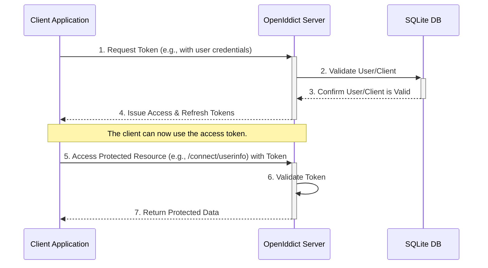

# Minimal OpenIddict Server - Technical Guide

## 1. Overview

This document provides a comprehensive technical guide to the minimal OpenIddict server implementation. The project serves as a foundational example of a secure, token-based authentication and identity provider using .NET 9, ASP.NET Core Identity, and OpenIddict v7.x+.

It is designed to be self-contained, easy to run, and simple to understand, utilizing a local SQLite database for straightforward setup and development.

### Key Features

- **OIDC & OAuth 2.0 Compliant**: Implements standard token-based authentication.
- **Multiple Grant Types**: Supports Password, Client Credentials, and Refresh Token flows.
- **ASP.NET Core Identity Integration**: Uses a robust framework for user management.
- **Self-Contained & Minimal**: All logic is contained within Program.cs for clarity.
- **Automatic Seeding**: Creates a default client and admin user on first run for immediate testing.
- **API-First Design**: Configured without UI pages, making it ideal for securing backend and single-page applications.

## 2. System Architecture

The server acts as a central authority for authentication. A client application (like a mobile app or a web frontend) communicates with the OpenIddict server to authenticate a user or itself, and in return, receives a secure token. This token is then used to access protected resources.

The flow can be visualized as follows:



## 3. Getting Started

### Prerequisites

- .NET 9 SDK
- An API client like Postman or the REST Client extension for Visual Studio Code.

### Running the Application

1. **Clone the Repository**: Get the source code on your local machine.
2. **Restore Dependencies**: Open a terminal in the root directory and run:
   ```bash
   dotnet restore
   ```
3. **Launch the Server**:
   ```bash
   dotnet run
   ```
   The server will start, and on its first run, it will create an `openiddict.db` file in the project folder.

### Database Seeding

The first time the application runs, it automatically seeds the database with essential data for testing:

- **Default Client**:
  - ClientId: `postman`
  - ClientSecret: `postman-secret`

- **Default User**:
  - Username: `admin@test.com`
  - Password: `AdminPassword123!`

## 4. Code Configuration (Program.cs)

All service configuration is done within the `Program.cs` file.

### A. DbContext and Identity

The server uses Entity Framework Core with SQLite. `ApplicationUser` extends the default `IdentityUser` to include `FirstName` and `LastName`.

```csharp
builder.Services.AddDbContext<ApplicationDbContext>(options =>
{
    options.UseSqlite("Data Source=openiddict.db");
    options.UseOpenIddict(); // Connects OpenIddict to EF Core
});

builder.Services.AddIdentity<ApplicationUser, IdentityRole>()
    .AddEntityFrameworkStores<ApplicationDbContext>()
    .AddDefaultTokenProviders();
```

### B. OpenIddict Server Configuration

This is the core of the implementation.

```csharp
builder.Services.AddOpenIddict()
    .AddCore(options => { /* ... */ })
    .AddServer(options =>
    {
        // 1. Set the URIs for the token, userinfo, and other endpoints.
        options.SetTokenEndpointUris("connect/token")
               .SetUserinfoEndpointUris("connect/userinfo")
               // ... other endpoints

        // 2. Explicitly enable the desired grant types.
        options.AllowPasswordFlow()
               .AllowRefreshTokenFlow()
               .AllowClientCredentialsFlow();
        
        // 3. Explicitly enable the endpoints themselves.
        options.AllowUserinfoEndpoint()
               .AllowIntrospectionEndpoint()
               .AllowRevocationEndpoint();

        // 4. Register the scopes the server can issue.
        options.RegisterScopes(Scopes.Email, Scopes.Profile, Scopes.Roles, "api");

        // 5. Configure development certificates.
        options.AddDevelopmentEncryptionCertificate()
               .AddDevelopmentSigningCertificate();
        
        // 6. Integrate with the ASP.NET Core pipeline.
        options.UseAspNetCore()
               .EnableTokenEndpointPassthrough()
               .EnableUserinfoEndpointPassthrough()
               // ... other passthroughs
    })
    .AddValidation(/* ... */);
```

## 5. API Endpoint Reference

The server exposes several endpoints for registration and OIDC flows.

| Method | Path | Description |
|--------|------|-------------|
| POST | `/register` | Creates a new user in the identity system. |
| POST | `/connect/token` | The primary OAuth 2.0 endpoint to exchange credentials or a refresh token for an access token. |
| GET | `/connect/userinfo` | Protected. Returns claims about the authenticated user based on the provided access token. |
| POST | `/connect/introspect` | Checks the status (active or inactive) of a token. Used by resource servers to validate a token. |
| POST | `/connect/revoke` | Invalidates a refresh or access token, effectively logging the user out from that token's perspective. |

### Example Request: POST /connect/token (Password Flow)

```http
POST https://localhost:7236/connect/token
Content-Type: application/x-www-form-urlencoded

grant_type=password&client_id=postman&client_secret=postman-secret&username=admin@test.com&password=AdminPassword123!&scope=openid profile api
```

### Example Response:

```json
{
    "access_token": "eyJhbGciOiJSUzI1Ni...",
    "token_type": "Bearer",
    "expires_in": 1800,
    "refresh_token": "v4_eyJ2ZXIiOjEsImtpZCI..."
}
```

## 6. Testing the Server

The included `api.http` file provides a comprehensive suite of requests to test every feature of the server.

To use it:

1. Open the project folder in Visual Studio Code.
2. Install the REST Client extension.
3. Open the `api.http` file.
4. Click the "Send Request" link that appears above each request block.

The test file is structured to guide you through:

- Registering a new user.
- Logging in via the password flow.
- Using the access token to fetch user info.
- Using the refresh token to get a new access token.
- Testing the client credentials flow.
- Testing error cases like invalid passwords.
